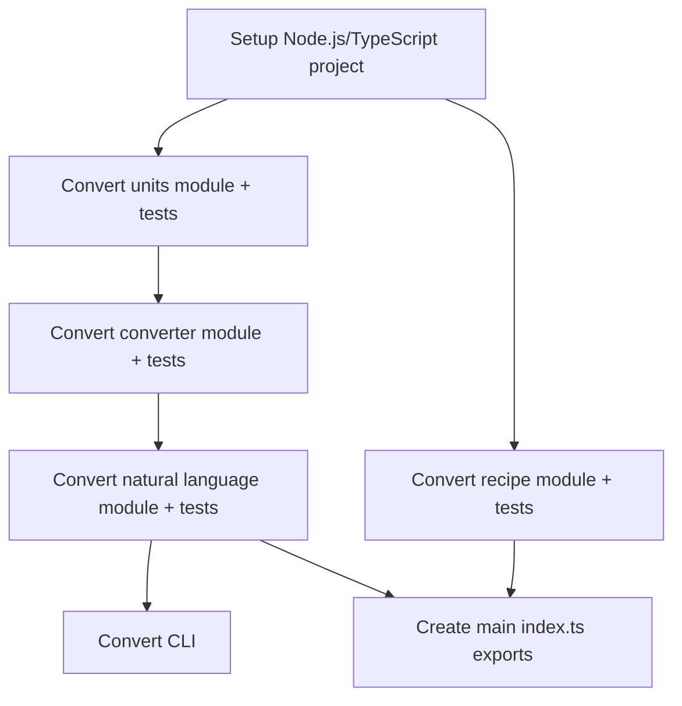

# Python to Node.js / TypeScript Migration Plan

The migration should be done in 1 (ONE) milestone. The milestone should have the following tasks:

## Task dependency diagram

## Task descriptions

### A - Setup Node.js/TypeScript project
**What it involves:**
- Initialize npm project (package.json)
- Install and configure TypeScript (tsconfig.json)
- Install dependencies: validation library (Zod/Yup for Pydantic replacement)
- Setup build configuration (tsc or equivalent)
- Configure testing framework (Jest/Vitest) to match pytest
- Create src/ and test/ directory structure

**Dependencies:** None

---

### B - Convert units module + tests
**What it involves:**
- Port `units.py` to `units.ts`
- Convert `UnitType` StrEnum to TypeScript enum
- Port `CONVERSIONS`, `UNIT_TYPES`, `BASE_UNITS` dictionaries to TypeScript objects/Maps
- Port `normalize_unit()` function
- Port `get_unit_type()` function
- Add TypeScript type annotations
- Port relevant tests from `test_converter.py` that test unit functions

**Dependencies:** A

---

### C - Convert recipe module + tests
**What it involves:**
- Port `recipe.py` to `recipe.ts`
- Convert Pydantic `Ingredient` model to TypeScript interface/class with validation
- Convert Pydantic `Recipe` model to TypeScript interface/class with validation
- Port `@field_validator` for servings validation
- Port `scale_recipe()` function
- Handle Pydantic features: optional fields, `model_dump()`, `extra="allow"`
- Port all tests from `test_recipe.py`

**Dependencies:** A

---

### D - Convert converter module + tests
**What it involves:**
- Port `converter.py` to `converter.ts`
- Port main `convert()` function with type safety
- Port `_convert_temperature()` helper function
- Convert Python match/case to TypeScript switch statement
- Maintain all conversion logic and formulas
- Import from units module
- Port all tests from `test_converter.py`

**Dependencies:** B

---

### E - Convert natural language module + tests
**What it involves:**
- Port `natural.py` to `natural.ts`
- Port `convert_natural()` function
- Port `_format_number()` helper
- Convert Python regex patterns to TypeScript RegExp
- Port all three pattern matching cases
- Import from converter module
- Port all tests from `test_natural.py`

**Dependencies:** D

---

### F - Create main index.ts exports
**What it involves:**
- Port `__init__.py` to `index.ts`
- Export all public APIs matching Python's `__all__`
- Setup barrel exports for clean imports
- Configure package.json entry points (main, types, module)

**Dependencies:** C, E

---

### G - Convert CLI
**What it involves:**
- Port `cli.py` to TypeScript
- Add Node.js shebang `#!/usr/bin/env node`
- Port argument parsing from sys.argv to process.argv
- Port help text and usage examples
- Configure bin entry in package.json
- Make file executable

**Dependencies:** E (only needs convert_natural from natural language module)

## Key decision points

1. **Validation library** (Task A/C): Choose Zod to replace Pydantic
2. **Testing framework** (Task A): Choose Jest to replace pytest
3. **Module system** (Task A): Use ESM
